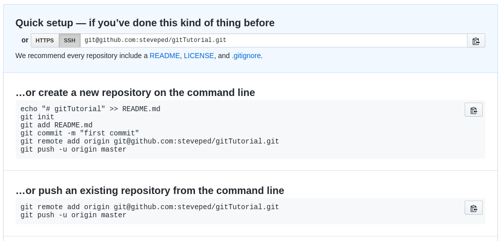

```{r setup, include=FALSE}
knitr::opts_chunk$set(echo = FALSE)
library(knitr)
```

<style type="text/css">
pre{
  background-color: #000000;
  color: #FFFFFF
}
</style>


## Key Sources For Today

- http://r-bio.github.io/intro-git-rstudio/
- http://swcarpentry.github.io/git-novice/


## What is Git?

- Stand-alone `bash` tool (+ Git for Windows)
- Version Control (+ more)
    - Keeps entire history of each file
    - Like a digital lab book for your code
- Enables very easy collaboration

---

```{r, out.width = "420px", fig.align='center'}
include_graphics("Images/phd101212s.gif")
```

## What is Git?

- We use `git` to track a local folder (and sub-folders)
    - Known as a `repository` in `git` terminology
    - We can specify certain files to ignore
    
- Great for managing specific analyses, packages, projects
    - Strongly integrated into RStudio
    
- We often `push` our `repository` (folder) to a remote website:
    - e.g. www.github.com or www.bitbucket.com
    - Securely backs all files up

## What is Git? | The Essential Terms

- `push`
    - we **push** (i.e. upload) our *local* `repo` to a *remote* `repo`
- `pull`
    - we **pull** (i.e. download) our *remote* `repo` to our *local* `repo` 
- `commit`
    - means we *take a record* of everything in the `repo` at that point
    - we write an informative "Commit Message"
    
---

```{r, out.width="600px", fig.align='center'}
include_graphics("Images/git_commit.png")
```

*(Source: xkcd.com)*

## What is Git? | The Common Terms

- Just typing `git` gives you the common terms

- When we use `git` we follow the syntax `git something`, e.g.
    - `git push`
    - `git pull`
    - `git commit`
- As with most bash tools, we'll often set additional options (`-a`, `-m` etc.)


# Our First Git Repo

## Initial Setup

1. Make sure you have `git` installed
2. Tell `git` who you are

```
git config --global user.name "Your Name"
git config --global user.email "you@somewhere.com"
```

- This user name and email will be associated with your subsequent Git activity
- Any changes pushed to GitHub, BitBucket, etc will include this information

## Our First Git Repo

1. Create a new folder somewhere called *gitTutorial*
2. Change into this folder (`cd gitTutorial`)
3. Next type `git init` followed by `ls -a`

This has created the 'hidden' folder `.git` which contains all the key information

## Our First Git Repo

Now we'll create an actual file:

```
echo "Introductory Git Tutorial" > README.md
```

Check it's there

```
ls
```

See where git is up to 

```
git status
```

## Our First Git Repo | `git add`

- We need to add this file to our git repo
    - Lets git know this is a track-able file
    
```
git add README.md
git status
```

- Git is now tracking this file

## Our First Git Repo 

**NB: We have not "committed" this file yet!**

- Git has added it to the **staging area**
    - Like a temporary holding area
- We can **change the file** and `git` will **check against the staged file**

We should have made that first line a header in markdown

```
echo "# Introductory Git Tutorial" > README.md
git status
```

## Our First Git Repo | `git diff`

We can use `git` to check the difference between the current file and the staged version

```
git diff README.md
```

- The staged version is in red
- The latest version is in green

## Our First Git Repo | `git diff`

Do we want to keep this change?

1. If `yes`, we need to stage the change $\implies$ `git add README.md`
2. If `no`, we follow the suggestion of `git status`   
$\implies$ `git checkout -- README.md`

```
git status
```

## Our First Git Repo | `git diff`

**I rarely use the staging area**

- It can be helpful for reverting after a catastrophic error

## Our First Git Repo | `git commit`

Let's get on with things again & make a commit

```
git commit -m 'Initial Commit'
git status
```
 
This should now give us the message:

```
On branch master
nothing to commit, working directory clean
```

## Our First Git Repo | Branches

- Git can track multiple `branches` within the same repo
    - Like parallel streams which we can merge into the main river at anytime
- The **default branch** is always `master`
- Branches are very useful for large software development & collaboration
- Beyond the scope of the rest of today

##  Our First Git Repo 

My favourite shortcut:

```
git commit -a -m 'Commit Message'
```

- Setting the `-a` flag adds **any unstaged changes** to the staging area **before** the commit
    - **Doesn't add unstaged files**
- I'll often run `git status` first just to check
- We can also add files using wildcards (e.g. `git add *`)
    
## The Basic Process

```{r, out.width="600px", fig.align='center'}
include_graphics(path = "Images/git-staging-area.svg")
```

*(Source: Software Carpentry)*

# Using a Remote

## GitHub

The most common web-based repo is www.github.com

1. Register an account
2. Create a new repository called `gitTutorial`
    - On your github home page click the green *New* button
    - Enter `gitTutorial` in the box
    - *Don't check any other boxes!!!*
    - Create Repository
    
---

### Which option do we want?

```{r, out.width="900px", fig.align='center'}

```

## GitHub | Setting Up A Remote

```
git remote add origin git@github.com:yourGitName/gitTutorial.git
git push -u origin master
```

Now refresh the website

1. We have set the `origin` as `git@github.com:yourGitName/gitTutorial.git`
    - This has the webpage `https://github.com/yourGitName/gitTutorial`
2. Then we have **pushed** the `master` branch to the `origin`

## Writing More Code

1. Let's add to the README file:

```
echo -e "\nI have no idea what I'm doing" >> README.md
```

2. Now we'll commit this amazing change

```
git commit -a -m 'True Confessions'
```

## Comparing Commits

- Every time we use `git commit` the commit is given a *hash*
    - A unique numeric identifier for each commit
    
```
git log
```

- This shows the full information, including the commit message
- An alternative convenient method is

```
git log --oneline
```

## Comparing Commits

```
git log --oneline
2a9939c True Confessions
256eab2 Initial Commit
```

We can use these numeric identifiers to compare files across commits

```
git diff 256eab2 README.md
```

Or we can step back through the `HEAD`

## Comparing Commits

```
git log --oneline --decorate
```

Gives me

```
2a9939c (HEAD, master) True Confessions
256eab2 (origin/master) Initial Commit
```

The latest commit is aka `HEAD`

```
git diff HEAD README.md
git diff HEAD~1 README.md
```

## Reverting To An Old Commit | `git checkout`

We can change back to an old version of a file using `git checkout`

```
git checkout 256eab2 README.md
```

- This replaces the current version, with the old version
- Any intermediate versions will still be in each commit

# Integration With RStudio